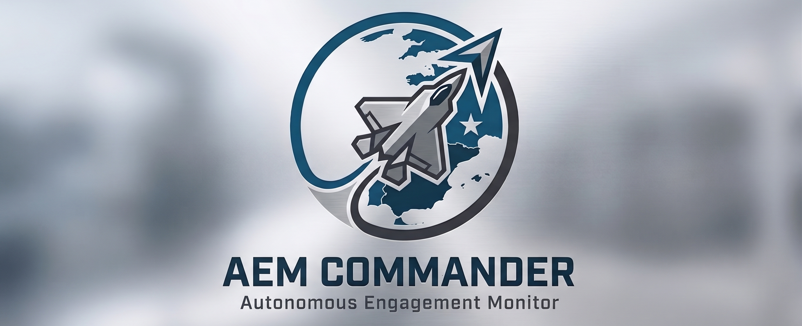

<p align="center">
  
</p>

# AEM Commander - Autonomous Engagement Monitor

`aem-commander` is a tool designed to connect the DCS World simulation environment with external Artificial Intelligence agents, enabling dynamic and automated decision-making in real-time. The system acts as a fully autonomous Theater Commander, monitoring the battlefield via simulated ISR and using Google's Gemini AI to make strategic decisions, deploy reserve units, and issue tactical orders.

## Project Status: Proof of Concept (PoC)

Currently, the project is in a **Proof of Concept (PoC)** stage. The system is fully functional, focusing on validating the end-to-end technical architecture:

1. **Data Collection:** Capturing events and the current state of the environment within the DCS World mission.
2. **App Transmission:** Sending the collected information to the local external application.
3. **AI Agent:** Processing and analyzing the data by an Artificial Intelligence agent.
4. **Instruction Injection:** Sending the AI-generated directives back into the simulator.
5. **Execution via MOOSE:** Receiving and successfully executing the instructions in-game.

---

## 1. Prerequisites & API Costs

> [!WARNING]  
> **API Usage Costs**  
> Running the external AI agent requires connecting to a third-party AI provider (currently Google Gemini) via API. **This will incur real-world costs based on token usage.** As the mission progresses and data is continuously analyzed, token consumption can increase. You are responsible for providing your own API key and monitoring your billing limits.

You must be authenticated to use the Google Gemini API, either with:
*   **API Key:** Can be obtained in [Google AI Studio](https://aistudio.google.com/welcome). Check your region for free tier availability; otherwise, billing activation is required.
*   **Vertex AI Service Account (JSON):** Harder to set up, but you get $300 in free credits to spend over 3 months by signing up on [Google Cloud](https://cloud.google.com/free).

---

## 2. Building from Source Code

To compile the application into a standalone executable for your operating system, you need [Node.js](https://nodejs.org/en/download) installed.

1. Clone or download this repository.
2. Open a terminal in the project folder and install the dependencies:
   ```bash
   npm install
   ```
3. Compile the application for your operating system using the following commands:
   * **For Windows:**
     ```bash
     npm run package-win
     ```
   * **For macOS:**
     ```bash
     npm run package-mac
     ```
   * **For Linux:**
     ```bash
     npm run package-linux
     ```
The compiled executable will be generated in the `out/` or `dist/` folder.

---

## 3. Mission Editor Configuration

To allow the AI to interact with your mission, you must structure your DCS mission following these strict conventions:

1. **Load JSON Library:** `json.lua` must be loaded into the mission via a trigger at mission start.
2. **Setup AI Reserves (Statics):** Add static objects representing the available units in the theater. Each static's name must start with the defined prefix and contain the tasks it can perform.
   * *Example:* `AEM_RES CAP INTERCEPT RED_Mig21Bis_0007`
3. **Setup Templates (Late Activation):** Place a late activation group for every unit type and task combination you included in your statics. The name must strictly follow the format: `[TEMPLATE_PREFIX][COALITION] [TASK] [UNIT TYPE]`.
   * *Example:* `AEM_TPL_RED CAP MiG-21Bis`
4. **Define Borders:** Create a late activation group with waypoints outlining the coalition's border. The first and last waypoints are virtually joined to create a closed polygon.
   * *Example:* `RED BORDER` or `BLUE BORDER`
5. **Define Goals (Trigger Zones):** Create trigger zones for the AI to attack, defend, or conquer. The zone name must start with `GOAL_RED` or `GOAL_BLUE`.
6. **Infantry Templates:** Place late activation infantry groups named `AEM_RED_INFANTRY` and `AEM_BLUE_INFANTRY` for the AI to use during troop transport tasks.
7. **CSAR Templates:** Place late activation groups for downed pilots (`BLUE DOWNED PILOT`, `RED DOWNED PILOT`) and rafts (`BLUE LIFE RAFT`, `RED LIFE RAFT`), and add the SOS audio file to the mission.

---

## 4. Lua Script Configuration (`aem-commander.lua`)

Before running the mission, open the `aem-commander.lua` script and adjust the variables at the top of the file to match your environment and preferences.

### Network & Core Settings
| Variable | Description |
| :--- | :--- |
| `MISSION_NAME` | The unique name of your mission. Used by the Persistence Manager to prevent loading incorrect save files. |
| `HOST_IP` | The IP address of the machine running the AEM Commander app (e.g., `"127.0.0.1"` if running on the same PC). |
| `AUTO_CONNECT` | Set to `true` to connect automatically on mission start, or `false` to connect manually via the F10 radio menu. |

### Mission Editor Naming Conventions
| Variable | Description | Default |
| :--- | :--- | :--- |
| `*_EW` | Prefix for early warning groups. They contribute to enemy detection regardless of unit type. | `"RED EW"` / `"BLUE EW"` |
| `*_SAM` | Prefix for surface-to-air missile groups. | `"RED SAM"` / `"BLUE SAM"` |
| `*_BORDER` | Late activation group defining the territory polygon. | `"RED BORDER"` / `"BLUE BORDER"` |
| `STATIC_RESOURCE` | Prefix for static units tasked by the AI. | `"AEM_RES"` |
| `TEMPLATE_PREFIX` | Prefix for late activation group templates used for spawning. | `"AEM_TPL_"` |

### Modules & Gameplay Features
| Variable | Description | Default |
| :--- | :--- | :--- |
| `MODULE_CSAR` | Toggles the Combat Search and Rescue mechanics. | `true` |
| `MODULE_CIV_TRAFFIC` | Toggles dynamic neutral civilian air traffic between airbases. | `true` |
| `MODULE_WILDFIRES` | Toggles dynamic spreading wildfires and helicopter firefighting mechanics. | `true` |
| `BALLISTIC_MISSILE_RANGE` | Maximum engagement range (in meters) for strategic missile strikes. | `400000` |
| `UNLIMITED_FUEL` | Grants unlimited fuel to AI-spawned flights to prevent them from dropping out of the sky. | `true` |

---

## 5. Running the System

1. Open the compiled **AEM Commander** application.
2. Enter your Gemini API Key or Vertex AI JSON file.
3. Configure your Commander settings (Refresh interval, Aggressiveness, Escalation system, etc.).
4. (Optional) Click **Load save file** or **Create new save** to enable state persistence.
5. Click **Start** in the app. The app will begin listening on port `49080`.
6. Start your DCS Mission. If `AUTO_CONNECT` is true, the script will immediately sync the Order of Battle and Goals with the app. If false, open the F10 Radio Menu and select **Connect to HQ**. 
7. To save your progress mid-mission, use the **F10 > AEM Commander > Save persistence state** menu in DCS. All active flights, destroyed units, and strategic inventory will be preserved.
